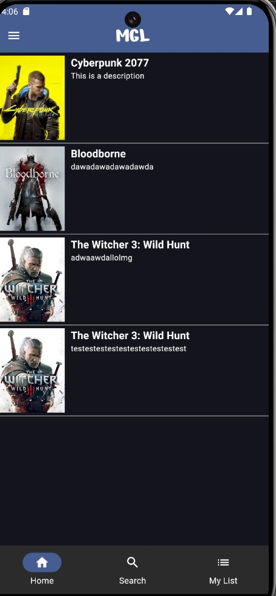
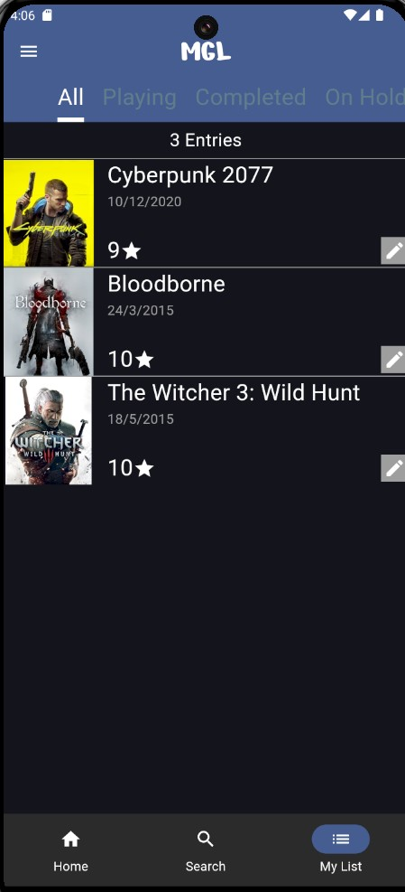
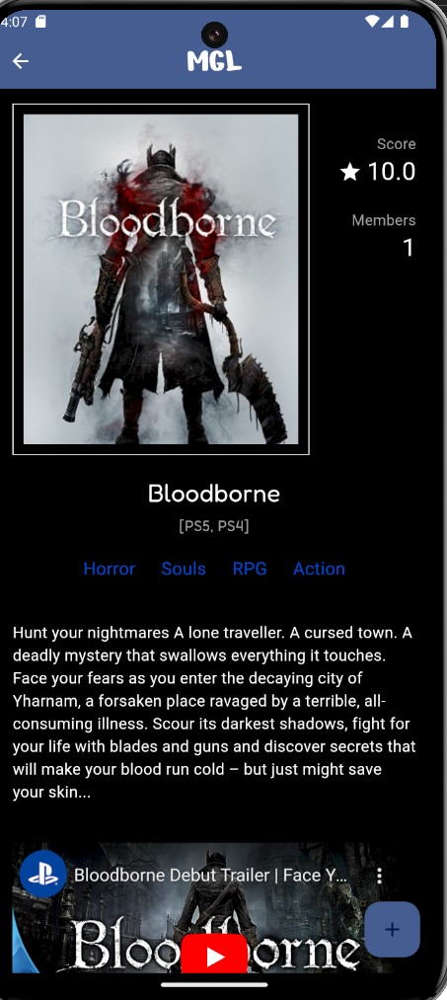
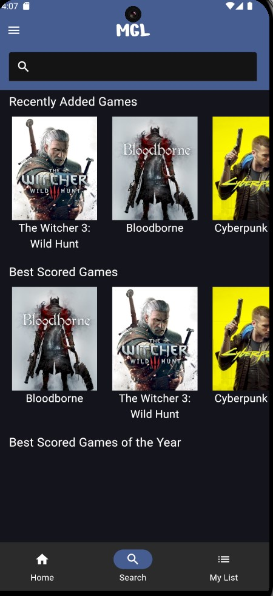
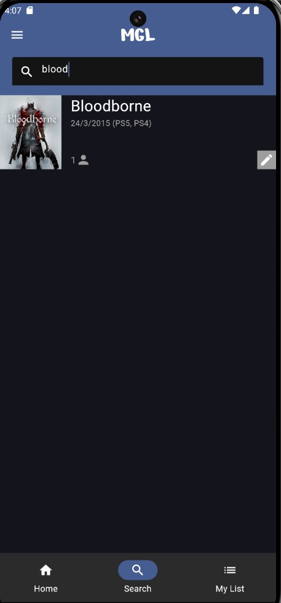

# **MyGameList**📱

## **Introduction**

**MyGameList** is a side project I started with the objective of learning flutter and firebase.  
The idea to do this project was born out of a realization that there are multiple Anime/TV shows applications that allow one to rate, review and keep track of Movies and TV shows, but there are very few for video games. This app, takes a lot of inspiration from the MAL(My Anime List) mobile application in it's UI design, and it allows it's users to do the same things IMDb and MAL do, but instead of using it for Movies/Shows, you use it for video games.

## **Features**

- 🔍 **Search Functionality**: Easily find what you're looking for with our robust search feature.
- 📝 **User Game Lists**: Users can create, manage, and view their game lists.
- 🕹 **Recently Added Games**: View the latest games added to the database, sorted by release date.
- 🏆 **Best Scored Games**: Check out the highest-scoring games of the year.
- ⚙️ **Firebase Integration**: All data is synced with Firebase for real-time updates.

## **Technologies Used**

- **Flutter**: The app is built with the Flutter framework, making it cross-platform compatible.
- **Dart**: All logic is written in Dart.
- **Firebase Firestore**: For real-time database functionality.
- **Firebase Authentication**: To handle user authentication.
- **Firebase Storage**: Used to store and retrieve game images.
- **Provider**: For state management.

## **Screenshots**

Here are some visual insights into the app:

| Home Page                          | Game List                          |
|-------------------------------------|------------------------------------|
|  |  |

| Game Page                          | Search                             |
|-------------------------------------|------------------------------------|
|  |  |

| Search Results                     |
|-------------------------------------|
|  |
